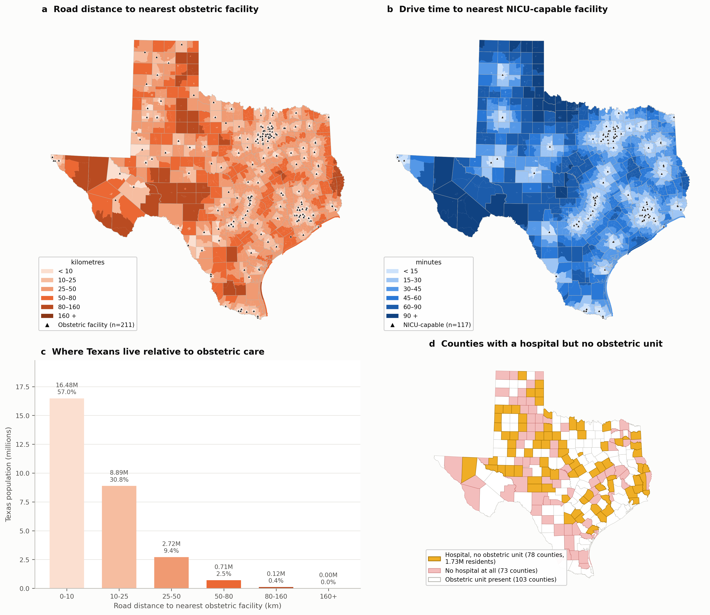
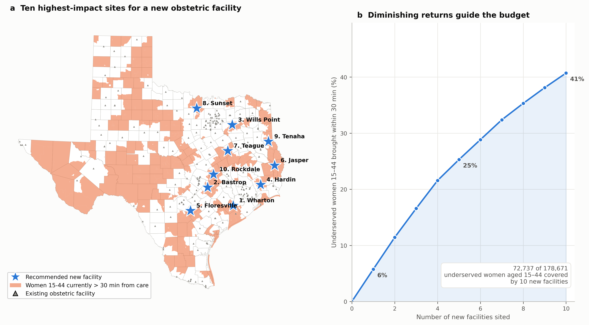
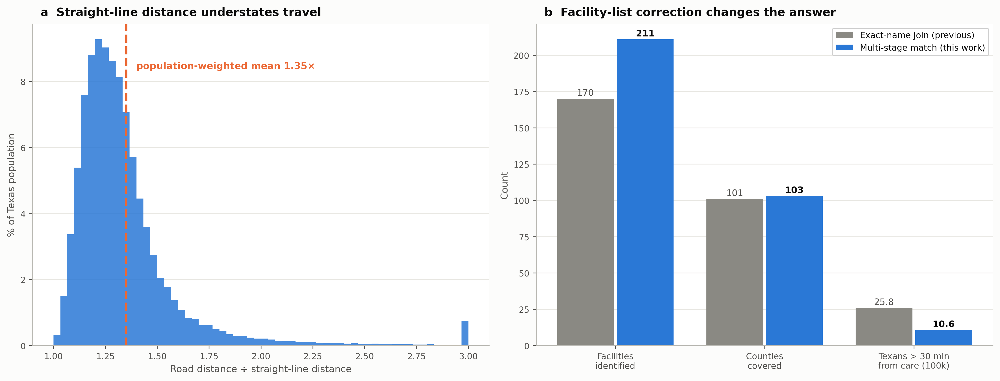

# From Maternity Care Deserts to a Siting Plan: A Block-Level Decision Platform for Obstetric Access in Texas

**Applicant organization:** Austin College, Sherman, Texas
**Principal Investigator:** Md Mohsan Khudri, PhD, Assistant Professor of Economics
**Amount requested:** $29,150

---

## Significance

Texas has the largest population of reproductive-age women of any state without a
statewide obstetric access standard. Maternal mortality rose 63% between 2018 and
2020, and the state review committee judged most of those deaths preventable
(Texas Women's Healthcare Coalition, 2024). Where a woman lives determines whether
she reaches skilled care in time.

The standard measure of that risk — the "maternity care desert," a county with no
obstetric facility — is too coarse to act on. A county is not a service area.
Counties in Texas range from 386 to 16,040 km²; averaging access across one hides
exactly the variation a planner needs. Worse, the county-level measure cannot
distinguish a county that never had a hospital from one whose hospital closed its
labor-and-delivery unit — clinically and politically very different problems.

**We have already built the measurement that replaces it.** Using the complete
Texas road network, we computed the drive time and road distance from **every one
of the 668,757 census blocks in Texas** to the nearest hospital that actually
provides obstetric care, weighted by **women aged 15–44** (ACS 2019–2023, table
B01001) rather than by total population. The results are preliminary but complete
— not a sample, not a model, every block:

| Finding | Value |
|---|---|
| Active hospitals providing obstetrics on site | **211** |
| Counties with no obstetric facility | **151 of 254** |
| Women aged 15–44 in Texas | **6,180,678** |
| Women 15–44 more than 30 min from obstetric care | **185,251** (3.0%) |
| Women 15–44 more than 30 min from **NICU-capable** care | **576,262** (9.4%) |
| Counties with a hospital but **no obstetric unit** | **78** (1.73M residents) |

Measured against the planning benchmarks the field uses, and weighted by the
population that actually uses obstetric care:

| Benchmark | Women 15–44 within it |
|---|---|
| 25 miles of an obstetric facility | 95.9% |
| 35 miles | 98.6% |
| 50 miles | 99.7% |
| 30 minutes | 97.0% |
| **30 minutes of a NICU-capable facility** | **90.6%** |

Two findings drive this proposal.

**First, the gap between those last two rows.** By distance alone, Texas looks
adequate: 95.9% of women of reproductive age are within 25 miles of an obstetric
facility. But only **90.6% are within 30 minutes of a facility with a neonatal
intensive care unit** — the capability that decides outcomes in a preterm birth
or a hemorrhage. Measured against NICU-capable care, the share left behind is
**three times larger** (9.4% vs 3.0%). Proximity to a door is not proximity to
care, and that distinction is exactly where preventable deaths occur — the
30-minute rows of the table above compare like with like.

**Second, 78 counties have an open hospital where no one can deliver a baby.**
1.73 million Texans live in them. These are not places that need a new hospital —
they need an obstetric unit restored inside one that already exists, at a
fraction of the cost. **No county-level desert map can see this distinction, and
every published Texas desert map misses it.** It is the cheapest available
intervention and nobody is currently able to target it.

**Figure 1** — *The access landscape.* (a) Road distance to the nearest
obstetric facility, in kilometres. (b) Drive time to the nearest NICU-capable
facility, in minutes — note the different unit and colour scale. (c) Texas
population by road-distance band. (d) Counties holding a hospital that has no
obstetric unit (gold) versus counties with no hospital at all (pink).

---

## Innovation

**1. We measure at census-block resolution on the real road network, not by
county and not in straight lines.** Our preliminary analysis shows road distance
in Texas is on average **1.33× the straight-line distance**, and considerably
worse in the sparse western road grid (Figure 3a). Buffer- and centroid-based
studies — still the norm in this literature — understate real travel by a third.

**2. We solved the computational obstacle that forces others to approximate.**
Naively, 668,757 blocks against 211 facilities is 141 million origin–destination
pairs. Commercial routing APIs cannot price that, which is why comparable studies
sample, aggregate to counties, or fall back on straight lines. We reformulated it:
because only the *nearest* facility matters, a single **multi-source Dijkstra
search on the transposed road graph** labels every node in Texas with its cost to
the closest facility in **one pass — about three seconds** over 11.0 million nodes
and 21.6 million road segments. No API, no quota, no sampling, no recurring cost.
This is what makes an interactive planning tool possible at all.

**3. We correct a failure mode that silently distorts this entire literature.**
Facility lists are built by joining a services registry to a location registry on
hospital name. We found the project's own prior list had been built with an exact
string match, which dropped 36% of eligible hospitals and simultaneously retained
hospitals that had already closed. The consequence is not random noise: **every
dropped hospital manufactures a fake desert.** Our multi-stage matcher — license
ID, then street address, then normalized fuzzy name, each blocked geographically —
recovers 98.1% of eligible hospitals automatically (Figure 3b). Correcting this
moved the count of Texans beyond 30 minutes from 2.58 million to 1.06 million.
**A published desert map built on an uncorrected join is wrong by a factor of
two.** We will release the matcher as a reusable component.

**4. The deliverable is a decision tool, not a paper.** The end product is a
web-based planning platform where a state or county planner sets a budget and a
coverage standard and receives a ranked, mapped siting plan with the population
served by each candidate site.

---

## Approach

### Aim 1 — Publish the corrected Texas obstetric access baseline *(months 1–4)*

The pipeline is built and runs end to end, and the women 15–44 denominator is
already in place. Remaining work: validate free-flow travel times against a
commercial routing engine on a stratified sample of ~500 routes; extend the
facility panel backward through CMS Provider of Services archives so the analysis
dates obstetric-unit *closures* rather than describing a single snapshot; and
disaggregate the ACS denominator below block-group level, which currently assumes
a uniform age–sex mix within each block group. **Deliverable:** peer-reviewed
paper and a public dataset of block-level access for all 668,757 Texas blocks.

### Aim 2 — Optimize where the next facility goes *(months 3–9)*

We formulate siting as the **Maximal Covering Location Problem**: choose *K* sites
maximizing the underserved population brought within a coverage standard.
Candidate sites are restricted to existing incorporated places, because a hospital
needs staff, utilities and road access — an optimum in empty rangeland is not an
answer a planner can use.

**This already works.** Figure 2 shows the current output: **ten new facilities
would bring 72,737 of the 178,685 underserved women aged 15–44 within 30 minutes
— 40.7% of the gap.** Because coverage is a monotone submodular function, the greedy
solution carries a provable (1 − 1/e) ≈ 63% approximation guarantee, so this is a
bounded result rather than a heuristic guess.

Grant work extends this baseline in three directions where it is genuinely
insufficient:

- **Cost-aware ILP.** Replace "K facilities" with a real budget. Restoring an
  obstetric unit in an existing hospital and building a new facility differ by
  more than an order of magnitude in cost; the 78 hospital-but-no-obstetrics
  counties are the cheap wins, and the model must be able to say so.
- **Capacity, via two-step floating catchment area (2SFCA).** Proximity ignores
  whether the nearest facility can absorb the demand. Bed counts and staffing are
  already in our data.
- **Sequential siting under uncertainty — where reinforcement learning earns its
  place.** For a *static* problem, ILP is superior to RL and we will not pretend
  otherwise. The real problem is not static: facilities are funded over several
  years, populations shift, and units continue to close. That is a sequential
  decision problem under uncertainty, and it is the setting where an RL policy
  genuinely outperforms re-solving a deterministic program. We will benchmark RL
  against the ILP optimum and **report the comparison honestly, including if RL
  does not win.**

**Figure 2** — *From diagnosis to decision.* (a) The ten highest-impact sites over
territory where women 15–44 are currently beyond 30 minutes. (b) Coverage versus
number of facilities; the curve is what lets a funder choose a defensible
stopping point.

### Aim 3 — Release the planning platform *(months 8–12)*

A browser tool, free and public: set budget and coverage standard, choose whether
to weight by women of reproductive age (the default) or all residents, target any
obstetric facility or only NICU-capable ones, and receive a ranked siting plan with a map
and an exportable table. Every input dataset is public, every step scripted, and
the code released under an open license so any state can rerun it. Texas is the
test case; the method is portable to all fifty states.

**Figure 3** — *Why the method matters.* (a) Road travel exceeds straight-line
distance by 1.33× on average, population-weighted. (b) What correcting the
facility list changed.

### Risks and mitigation

| Risk | Mitigation |
|---|---|
| CMS obstetric-service flags lag real closures | Cross-check against Texas DSHS maternal designations and AHA survey; report the vintage of every flag |
| Free-flow travel times ignore congestion | Aim 1 calibrates against a commercial routing engine; distance results are unaffected |
| RL underperforms ILP | Explicitly an experimental comparison, not an assumption; ILP is the shipped default |
| Cross-border access unmodeled | Extend the network extract to bordering states for border counties |

### Benchmarks for success

1. Block-level access dataset published, all 668,757 blocks *(month 4)*
2. Travel-time validation r ≥ 0.95 against a commercial routing engine *(month 5)*
3. ILP and RL benchmarked against the greedy bound *(month 9)*
4. Public platform live with ≥ 3 named agency or advocacy users *(month 12)*
5. One manuscript submitted; code and data publicly archived *(month 12)*

---

## Investigators

**Md Mohsan Khudri, PhD** (PI), Assistant Professor of Economics, Austin College.
Overall direction, study design, empirical strategy, and translation to policy.
Accountable for timelines, deliverables, IRB and data governance, and sponsor
communication.

**Navid Mohammad Imran, PhD** (co-I), Assistant Professor of Computer Science,
William Paterson University. Optimization formulation and the reinforcement
learning comparison.

**Lokesh Das, PhD** (co-I), Assistant Professor, School of Computing, Wichita State
University. Solution framework, data integration, and the planning platform.

**Alamgir Hosain, PhD** (co-I), Research Scientist, EnviTrace, Santa Fe, New
Mexico. Computational geoscientist. Built the preliminary study underpinning this
proposal — the corrected facility registry, the 11-million-node road network, and
the routing engine. Leads data acquisition and integration, the demand surfaces
driving the optimization models, probabilistic coverage under budget constraints,
and reproducibility of the released software.

---

## Budget

Indirect costs are limited to 10% of the total budget, per Foundation guidelines.

| Line item | Amount |
|---|---|
| PI summer salary (1 month) | $7,500 |
| Co-investigator stipends (3 × $2,500) | $7,500 |
| Graduate research assistant (10 months, part time) | $6,000 |
| Cloud compute and storage | $1,200 |
| Platform hosting and domain (3 years) | $900 |
| Routing-engine validation credits and data | $1,135 |
| Dissemination (one conference, open-access fee) | $2,000 |
| **Total direct costs** | **$26,235** |
| Indirect costs (10% of total) | $2,915 |
| **Total requested** | **$29,150** |

Austin College provides in-kind analytics lab access, secure storage, computing,
seminar space, staff support, and pre- and post-award administration. No matching
or pending funds are committed to this project.

---

## Resources

Austin College endorses this project and will support it through the grant period,
maintaining access to the analytics lab, seminar space, and secure storage, and
providing IT support, account provisioning, and purchasing. The IRB and data
governance offices will guide human-subjects review and data use agreements; the
project uses only public, de-identified aggregate data and is expected to qualify
as non-human-subjects research.

All computation to date has run on standard hardware — the full statewide analysis
completes in under ten minutes on a laptop — so the project carries no
high-performance computing dependency and no recurring API cost.

---

## Data sources

All inputs are public. US Census Bureau TIGER/Line 2024, 2020 Decennial
population and ACS 2019–2023 (public domain); Census 2020 Centers of Population;
CMS Provider of Services file (obstetric and neonatal service codes); HIFLD
hospital locations;
and OpenStreetMap via Geofabrik for the road network (ODbL — © OpenStreetMap
contributors), verified against the publisher's published MD5 checksum.

## References

American College of Obstetricians and Gynecologists & Society for Maternal–Fetal
Medicine. (2019). *Levels of maternal care* (Obstetric Care Consensus No. 9).

Centers for Disease Control and Prevention, National Center for Health Statistics.
(2023). *Maternal mortality rates in the United States, 2021.*

Chartis Center for Rural Health. (2024). *Unrelenting pressure pushes rural safety
net crisis into uncharted territory.*

Church, R., & ReVelle, C. (1974). The maximal covering location problem. *Papers in
Regional Science, 32*(1), 101–118.

Luo, W., & Qi, Y. (2009). An enhanced two-step floating catchment area (E2SFCA)
method for measuring spatial accessibility to primary care physicians. *Health &
Place, 15*(4), 1100–1107.

March of Dimes. (2023). *Where you live matters: Maternity care in Texas.*

Meredith, M. E., Steimle, L. N., & Radke, S. M. (2024). The implications of using
maternity care deserts to measure progress in access to obstetric care: A
mixed-integer optimization analysis. *BMC Health Services Research, 24*, 682.

Nemhauser, G. L., Wolsey, L. A., & Fisher, M. L. (1978). An analysis of
approximations for maximizing submodular set functions. *Mathematical Programming,
14*(1), 265–294.

Texas Administrative Code, 25 TAC §§133.208–133.209. *Maternal designation
Levels III and IV.*

Texas Women's Healthcare Coalition. (2024). *Texas releases 2024 maternal health
report.*

U.S. Government Accountability Office. (2022). *Availability of hospital-based
obstetric care in rural areas* (GAO-23-105515).
